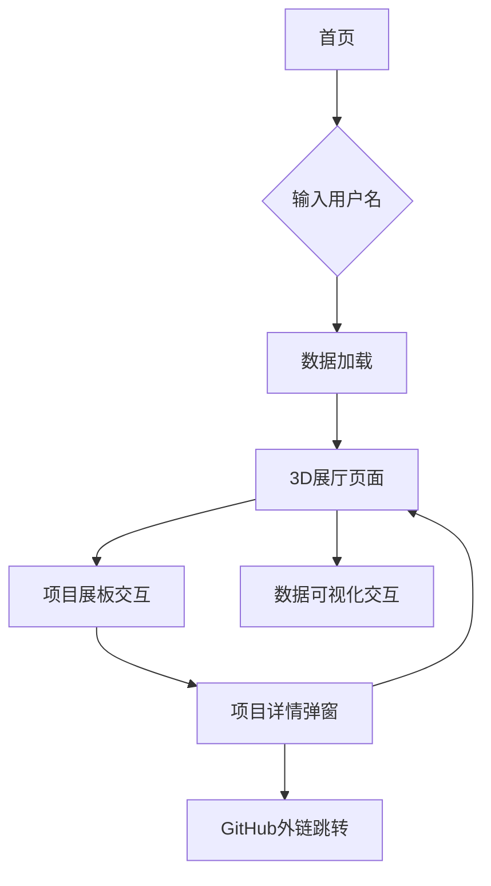

# Web3D GitHub Exhibition - 产品需求文档

## 1. 产品概述

构建一个基于Web的3D虚拟展厅，用于沉浸式展示GitHub用户的代码仓库和编程数据。用户可通过第一人称视角在虚拟空间中自由探索，查看项目展板和数据可视化内容。

该产品旨在为开发者提供一个创新的作品展示平台，将传统的代码仓库列表转化为具有科技感和互动性的3D体验，提升个人技术品牌的展示效果。

目标市场：面向希望以创新方式展示技术作品的开发者、技术团队和招聘方。

## 2. 核心功能

### 2.1 用户角色

| 角色       | 访问方式   | 核心权限                       |
| -------- | ------ | -------------------------- |
| 访问者      | 直接访问网站 | 可输入GitHub用户名，浏览3D展厅，查看项目信息 |
| GitHub用户 | 通过分享链接 | 可查看自己的专属展厅，获取分享链接          |

### 2.2 功能模块

本产品包含以下核心页面：

1. **首页**：用户名输入界面、加载状态显示、错误处理提示
2. **3D展厅页面**：虚拟展厅环境、项目展板展示、数据可视化中心、交互控制系统
3. **项目详情弹窗**：仓库详细信息、外链跳转功能

### 2.3 页面详情

| 页面名称   | 模块名称    | 功能描述                          |
| ------ | ------- | ----------------------------- |
| 首页     | 用户输入区   | 输入GitHub用户名，验证用户存在性，显示加载进度    |
| 首页     | 导航说明    | 展示操作指南和功能介绍                   |
| 3D展厅页面 | 场景渲染    | 渲染3D虚拟展厅环境，包含墙壁、地面、天花板、照明系统   |
| 3D展厅页面 | 移动控制    | WASD键盘移动，鼠标视角控制，碰撞检测系统        |
| 3D展厅页面 | 入口区域    | 显示GitHub用户头像、用户名、基本统计信息       |
| 3D展厅页面 | 项目展板墙   | 动态生成仓库展板，显示仓库名称、描述、Star数、主要语言 |
| 3D展厅页面 | 数据可视化中心 | 3D图表展示编程语言分布、提交活跃度、仓库类型统计     |
| 3D展厅页面 | 交互系统    | 点击展板查看详情，悬停显示提示信息             |
| 项目详情弹窗 | 详情展示    | 显示仓库完整信息、README预览、技术栈标签       |
| 项目详情弹窗 | 外链功能    | 跳转到GitHub仓库页面、在线预览（如适用）       |

## 3. 核心流程

**主要用户操作流程：**

1. 用户访问网站首页
2. 输入目标GitHub用户名
3. 系统验证用户存在性并获取数据
4. 加载3D展厅场景
5. 用户使用WASD+鼠标在展厅中自由移动
6. 浏览项目展板和数据可视化内容
7. 点击感兴趣的项目查看详情
8. 通过链接访问GitHub原始仓库

**页面导航流程图：**

## 4. 用户界面设计

### 4.1 设计风格

* **主色调**：深蓝色 (#1a1a2e) 和科技蓝 (#16213e)，辅助色为亮蓝色 (#0f3460) 和白色 (#ffffff)

* **按钮样式**：圆角矩形，渐变背景，悬停发光效果

* **字体**：主要使用 'Inter', 'SF Pro Display'，代码字体使用 'Fira Code', 'Monaco'

* **字体大小**：标题 24-32px，正文 14-16px，说明文字 12px

* **布局风格**：极简科技风，卡片式设计，网格布局

* **图标风格**：线性图标，统一使用 Feather Icons 或 Heroicons

* **动画效果**：平滑过渡，微妙的悬停动画，加载动画

### 4.2 页面设计概览

| 页面名称   | 模块名称  | UI元素                        |
| ------ | ----- | --------------------------- |
| 首页     | 用户输入区 | 居中布局，大尺寸输入框，渐变背景，GitHub图标装饰 |
| 首页     | 导航说明  | 底部固定，半透明卡片，简洁图标+文字说明        |
| 3D展厅页面 | 场景渲染  | 全屏3D画布，深色科技风材质，动态光影效果       |
| 3D展厅页面 | UI覆盖层 | 左上角用户信息卡片，右下角操作提示，半透明背景     |
| 3D展厅页面 | 项目展板  | 发光边框，悬浮效果，渐变背景，清晰的层次结构      |
| 项目详情弹窗 | 弹窗容器  | 居中模态框，毛玻璃背景，圆角设计，关闭按钮       |
| 项目详情弹窗 | 内容区域  | 分栏布局，标签系统，按钮组，滚动区域          |

### 4.3 响应式设计

* **桌面优先**：主要针对桌面端体验优化，支持1920x1080及以上分辨率

* **移动适配**：提供简化的移动端界面，触摸操作优化

* **交互优化**：桌面端支持键鼠操作，移动端支持触摸手势和虚拟摇杆

