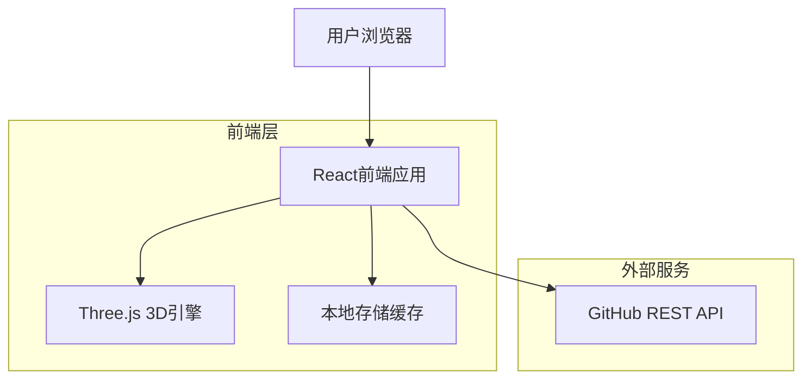
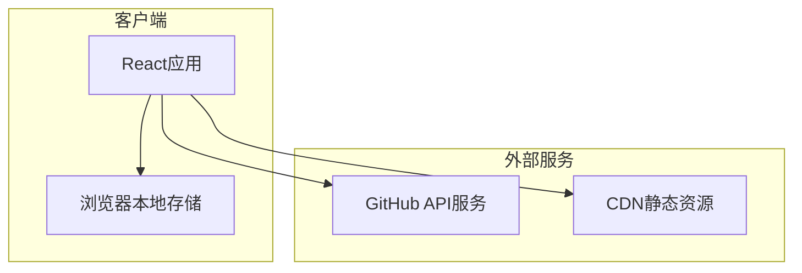
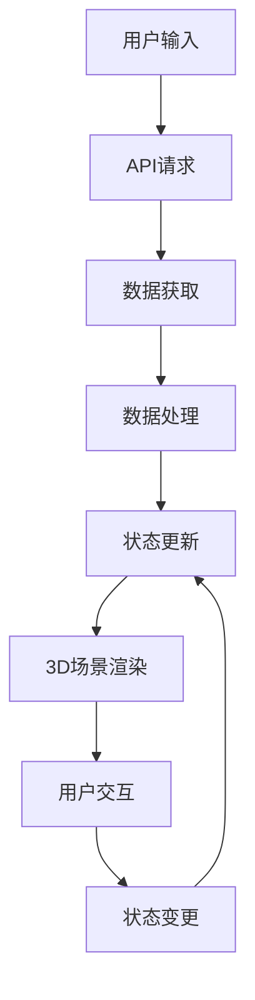

# Web3D GitHub Exhibition - 技术架构文档

## 1. 架构设计



## 2. 技术描述

* **前端**: React\@18 + TypeScript + Vite + Three.js + TailwindCSS

* **3D引擎**: Three.js\@0.158 + React Three Fiber + Drei

* **状态管理**: Zustand

* **HTTP客户端**: Axios

* **构建工具**: Vite

* **部署**: Vercel/Netlify

## 3. 路由定义

| 路由                 | 用途                     |
| ------------------ | ---------------------- |
| /                  | 首页，用户输入GitHub用户名       |
| /gallery/:username | 3D展厅页面，展示指定用户的GitHub数据 |
| /error             | 错误页面，处理用户不存在或API错误     |

## 4. API定义

### 4.1 GitHub API集成

**获取用户基本信息**

```
GET https://api.github.com/users/{username}
```

响应数据：

| 字段名           | 类型     | 描述     |
| ------------- | ------ | ------ |
| login         | string | 用户名    |
| name          | string | 显示名称   |
| avatar\_url   | string | 头像URL  |
| bio           | string | 个人简介   |
| public\_repos | number | 公开仓库数量 |
| followers     | number | 关注者数量  |
| following     | number | 关注数量   |

**获取用户仓库列表**

```
GET https://api.github.com/users/{username}/repos?sort=updated&per_page=100
```

响应数据：

| 字段名               | 类型        | 描述         |
| ----------------- | --------- | ---------- |
| name              | string    | 仓库名称       |
| description       | string    | 仓库描述       |
| stargazers\_count | number    | Star数量     |
| language          | string    | 主要编程语言     |
| html\_url         | string    | GitHub页面链接 |
| updated\_at       | string    | 最后更新时间     |
| topics            | string\[] | 仓库标签       |

**获取仓库语言统计**

```
GET https://api.github.com/repos/{username}/{repo}/languages
```

响应数据：

```json
{
  "JavaScript": 12345,
  "TypeScript": 8901,
  "CSS": 2345
}
```

### 4.2 核心数据类型定义

```typescript
// 用户信息接口
interface GitHubUser {
  login: string;
  name: string;
  avatar_url: string;
  bio: string;
  public_repos: number;
  followers: number;
  following: number;
}

// 仓库信息接口
interface Repository {
  id: number;
  name: string;
  description: string;
  stargazers_count: number;
  language: string;
  html_url: string;
  updated_at: string;
  topics: string[];
  languages?: LanguageStats;
}

// 语言统计接口
interface LanguageStats {
  [language: string]: number;
}

// 3D展板位置接口
interface ExhibitPosition {
  x: number;
  y: number;
  z: number;
  rotation: number;
}

// 应用状态接口
interface AppState {
  user: GitHubUser | null;
  repositories: Repository[];
  languageStats: LanguageStats;
  loading: boolean;
  error: string | null;
  currentRepo: Repository | null;
}
```

## 5. 服务器架构图

由于本项目为纯前端应用，无需后端服务器，直接调用GitHub公开API。



## 6. 数据模型

### 6.1 数据流设计



### 6.2 本地存储结构

**缓存策略**

```typescript
// LocalStorage键值对
interface CacheData {
  'github-user-{username}': {
    data: GitHubUser;
    timestamp: number;
    ttl: number; // 缓存时间：1小时
  };
  'github-repos-{username}': {
    data: Repository[];
    timestamp: number;
    ttl: number; // 缓存时间：30分钟
  };
  'app-settings': {
    graphics: 'low' | 'medium' | 'high';
    sound: boolean;
    lastVisitedUser: string;
  };
}
```

### 6.3 3D场景数据结构

```typescript
// 展厅布局配置
interface GalleryLayout {
  dimensions: {
    width: number;
    height: number;
    depth: number;
  };
  walls: WallConfig[];
  lighting: LightConfig[];
  exhibits: ExhibitConfig[];
}

// 墙壁配置
interface WallConfig {
  position: [number, number, number];
  rotation: [number, number, number];
  dimensions: [number, number, number];
  material: string;
}

// 展板配置
interface ExhibitConfig {
  id: string;
  position: [number, number, number];
  repository: Repository;
  interactive: boolean;
}

// 数据可视化配置
interface DataVisualization {
  type: 'bar' | 'pie' | 'scatter';
  data: LanguageStats;
  position: [number, number, number];
  scale: [number, number, number];
  animation: boolean;
}
```

## 7. 性能优化策略

### 7.1 前端优化

* **代码分割**: 使用React.lazy()和Suspense进行路由级别的代码分割

* **资源优化**: 纹理压缩、模型优化、LOD（细节层次）技术

* **渲染优化**: 视锥体剔除、遮挡剔除、实例化渲染

* **内存管理**: 及时释放Three.js对象，避免内存泄漏

### 7.2 API优化

* **请求缓存**: 本地存储API响应，减少重复请求

* **并发控制**: 限制同时进行的API请求数量

* **错误重试**: 实现指数退避重试机制

* **数据预处理**: 在获取数据后立即进行必要的计算和转换

### 7.3 用户体验优化

* **渐进式加载**: 优先加载核心功能，逐步加载详细内容

* **加载状态**: 提供详细的加载进度和状态反馈

* **错误处理**: 友好的错误提示和恢复机制

* **响应式设计**: 适配不同设备和屏幕尺寸

